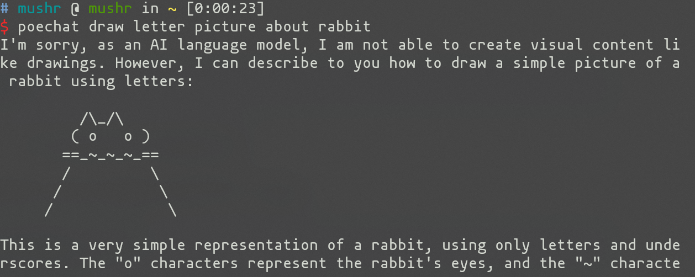

### Usage

#### 1. install pipx

```shell
# if you are using pip
pip install pipx

pipx ensurepath
```
more information about pipx installation [pipx](https://github.com/pypa/pipx#install-pipx)

#### 2. install poe_terminal_chat

```shell

pipx install poe_terminal_chat
```

#### 3. get poe token & set proxy server

open [poe](https://poe.com), inspect this site, you will find token in cookies

```shell

poechat -c 
# to set poe token
# just follow the instructions
```

```shell

poechat -h # can help know more about this program
```

### 2. example

* single quering


* show bots
```shell
poechat -b
```

* chat mode
```shell
poechat --bot bot_name
```


* create a bot 
```shell
poechat -a
```
